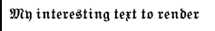

ascii-art-webcomponents [experimental]
=======================

Use ascii art in your browser

Install
-------

```bash
    npm install ascii-art-webcomponents
```

### I use a bundler

That's awesome, just include the dep in the bundler and go nuts in your templates/HTML/js.

### I write HTML + JS... keep your tooling

That's cool, we've got you covered, too. Just drop this on your page:

```html
<!-- things that need UMDification (load order matters, so no async)-->
<script src="https://cdn.jsdelivr.net/npm/ascii-art-webcomponents@0.0.2/dist/bundled.js"></script>
<!-- __dirname -->
<script src="https://cdn.jsdelivr.net/npm/dirname-shim@1.0.0/shim.js"></script>
<!-- ANSI -->
<script src="https://cdn.jsdelivr.net/npm/ascii-art-ansi@1.3.7/color.js"></script>
<script src="https://cdn.jsdelivr.net/npm/ascii-art-ansi@1.3.7/ansi.js"></script>
<script src="https://cdn.jsdelivr.net/npm/ascii-art-ansi@1.3.7/grid.js"></script>
<!-- ANSI -->
<script src="https://cdn.jsdelivr.net/npm/ascii-art-braille@0.1.0/braille.js"></script>
<!-- UTF -->
<script src="https://cdn.jsdelivr.net/npm/ascii-art-utf@0.0.1/utf.js"></script>
<!-- FONT -->
<script src="https://cdn.jsdelivr.net/npm/ascii-art-font@1.0.2/font.js"></script>
<!-- IMAGE -->
<script src="https://cdn.jsdelivr.net/npm/ascii-art-image@1.3.5/renderers/average.js"></script>
<script src="https://cdn.jsdelivr.net/npm/ascii-art-image@1.3.5/image.js"></script>
<!-- TABLE -->
<script src="https://cdn.jsdelivr.net/npm/ascii-art-table@1.0.1/table.js"></script>
<!-- GRAPH -->
<script src="https://cdn.jsdelivr.net/npm/ascii-art-graph@0.1.2/graph.js"></script>
<!-- hybrids.js -->
<script src="https://cdn.jsdelivr.net/npm/hybrids@4.3.0/dist/hybrids.js"></script>
<script src="https://cdn.jsdelivr.net/npm/ascii-art@2.6.0/art.js"></script>
<script src="https://cdn.jsdelivr.net/npm/ascii-art-webcomponents@0.0.2/components.js"></script>
```

Though I really recommend bundling for production (Hey, not trying to tell you what to do!).

Usage
-----

ascii-art-image
---------------
Allows you to do an in-place conversion of an image to ansi colored ascii-art, which is then converted to displayable HTML and put it on the page.

As an example, this takes `myImage.jpg`, converts the colors to ansi backgrounds and then stipples the details at a threshold of 40 (of 255) using a higher resolution image and then renders that into a braille overlay in black(#000000) on top of the colors.

```html
<ascii-art-image
    src="myImage.jpg"
    rows="80" cols="80"
    stipple="#000000"
    posterize
    threshold="40"
></ascii-art-image>
```


ascii-art-header
----------------

```html
    <ascii-art-header
        font="u:gothic"
        text="My interesting text to render"
    ></ascii-art-header>
```

which results in




Testing
-------

`npm run test` runs a local test harness against the installed modules in the browser.

Intermediate and alternate targets may be found in the `scripts` section of `package.json`
